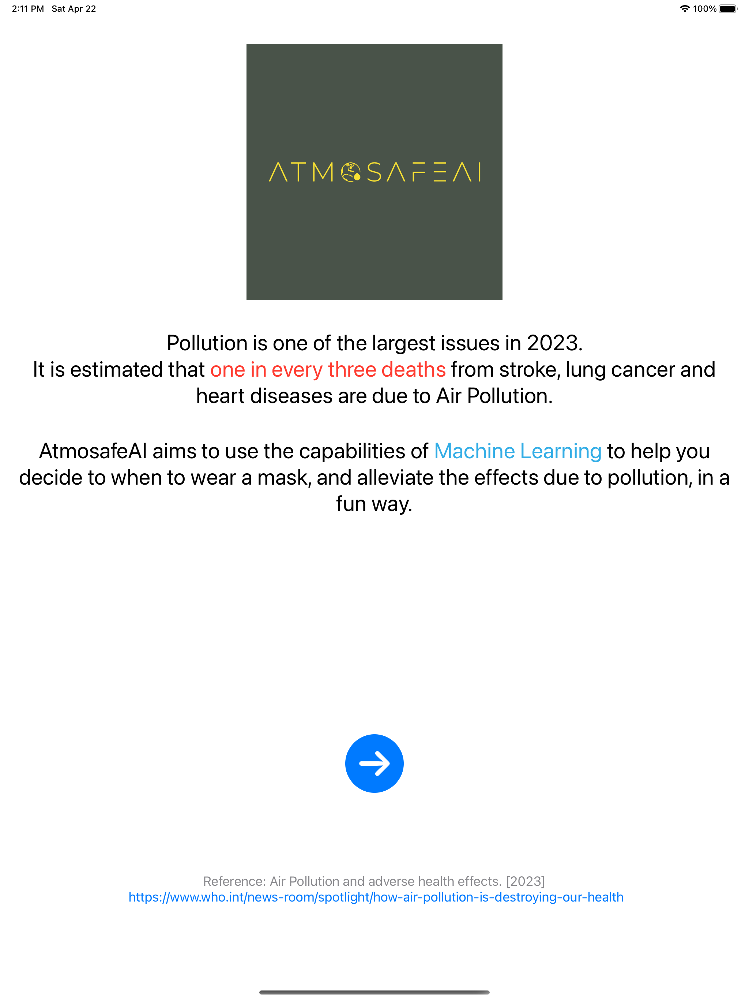
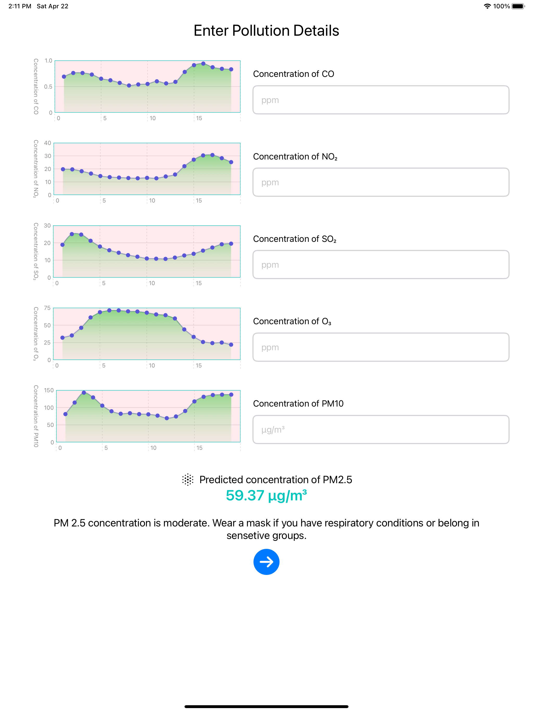
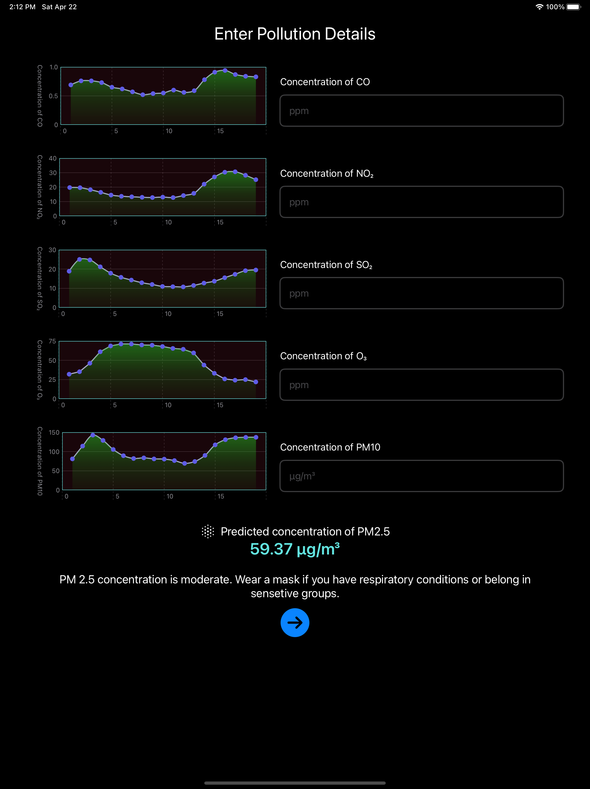
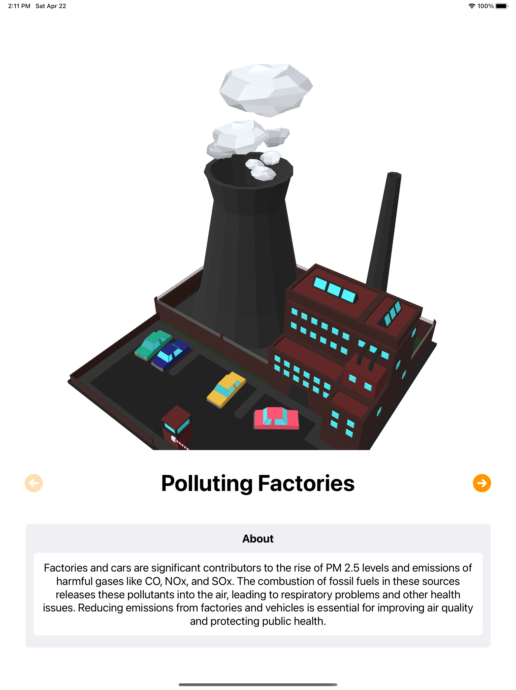
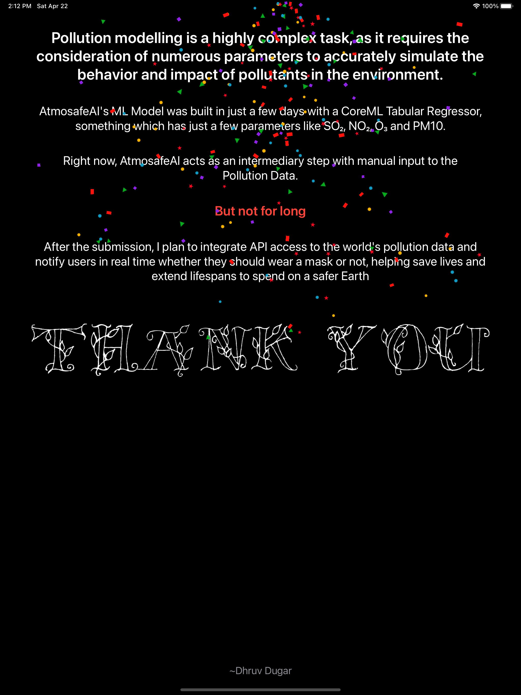

# AtmosafeAI

 

AtmosafeAI is my Swift Student Challenege Submission for WWDC 2023. It is an app made with the use of **Swift**, **SwiftUI**, **UIKit**, **CoreML** and **Charts**. It is a simple app that uses the current pollution data to predict the Air Quality Index and the PM 2.5 levels. 

It also helps to predict if you need to wear a mask on the basis of the prevailing conditions and how can we, as all humankind together help reduce the pollution levels.

# Screenshots

### Landing Screen

 

### Responsive UI made for both light and dark mode.

  
  

 

### Using SceneKit to display 3D USDZ mdoels for a more vibrant and interactive view.

 

### Custom Confetti Animation made using UIKit
